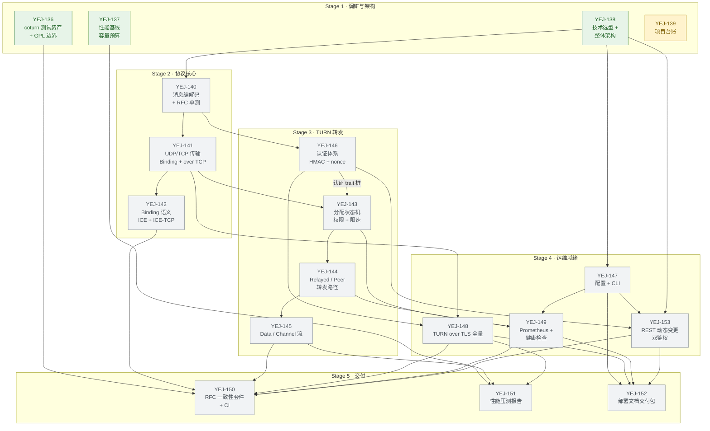

# QuickRelay 项目台账：五阶段里程碑、Issue 依赖图与风险登记

> **文档定位**：项目级台账（project ledger），回答「接下来做什么、什么顺序、被什么挡住、坏在哪」。
> **维护方式**：本文档**不复制**各 issue 的正文内容。权威口径（性能、协议范围、鉴权方式）一律引用到对应 issue；本台账只记录**依赖关系、阶段门槛、里程碑触发条件与风险**，以及这些口径在 issue 之间的偏差。
> **台账版本**：v1（2026-09-15）。上游架构结论（YEJ-138）如后续调整依赖图，本台账须在下一轮更新。

---

## 1. 台账元数据

| 项 | 内容 |
| --- | --- |
| 父 issue | YEJ-135（QuickRelay：高性能 STUN/TURN 服务器） |
| 台账 issue | YEJ-139（本台账） |
| 子 issue 总数 | 18（YEJ-136 ~ YEJ-153，含 YEJ-153） |
| 仓库 | `https://github.com/yejinlei/QuickRelay`（worktree 模式，`F:\src\QuickRelay`） |
| 本文档落点 | `docs/project/milestones.md`，PR 目标分支 `main` |
| 语言 / 基线 | Rust 2021+，稳定版 toolchain |
| 上游参考 | coturn（**GPL-2.0，仅参照行为，不得拷贝代码**） |
| 权威容量口径 | 单机 500 路视频并发 · 2 Gbps 双向吞吐 · 控制面 P99 < 1 ms（TLS over TCP 路径 P99 < 5 ms，见 YEJ-148） |
| 已废弃口径 | 旧的大并发数字口径（已被需求方口径取代）——本台账一律不出现该数字，验收目标只引用「500 路 / 2 Gbps / P99 < 1 ms」 |
| 台账状态快照 | 2026-09-15 18:30（本地）；见 §3 |

**权威口径引用**（避免二次漂移，本台账不展开数值推导）：

| 口径 | 权威出处 |
| --- | --- |
| 500 路 / 2 Gbps / P99 < 1 ms；旧大并发口径禁用 | YEJ-137（性能基线与容量预算）正文「权威性能口径」段 |
| 协议 attribute 矩阵、crate 划分、线程模型 | YEJ-138（架构）→ `docs/architecture/` |
| TLS 组合范围（UDP-over-TLS 必须 + TLS over TCP 必须；RFC 6061 仅兼容） | YEJ-138 §8 / YEJ-148 正文 |
| REST 端点范围与双鉴权（Bearer + HMAC） | YEJ-138 §9 + YEJ-153 正文「与架构的偏差」表 |
| 测试资产清单与 GPL 边界 | YEJ-136 正文 |

---

## 2. 依赖图

依赖关系**逐条取自各子 issue 正文的「前置依赖」段**，未做编号推测。

### 2.1 拓扑排序与并行组（G0–G7）

| 组 | Issue | 前置依赖（原文口径） |
| --- | --- | --- |
| **G0** | YEJ-136 | 无 |
| | YEJ-137 | 无 |
| | YEJ-138 | 与 136/137 并行；两者结论为输入，未定稿时按假设推进并标注待回填 |
| | YEJ-139 | 18 个子 issue 已创建；与架构设计并行 |
| **G1** | YEJ-140 | YEJ-138（crate 划分 + attribute 矩阵 + 技术选型定稿） |
| **G2** | YEJ-141 | YEJ-140 + YEJ-138（线程模型） |
| **G3** | YEJ-142 | YEJ-140 + YEJ-141 |
| | YEJ-146 | YEJ-140 + YEJ-143 的 trait 桩 + YEJ-138（REST 边界） |
| | YEJ-143 | YEJ-140 + YEJ-141 + YEJ-138（会话表/内存模型）+ YEJ-146（认证 trait） |
| **G4** | YEJ-144 | YEJ-143 + YEJ-141 |
| **G5** | YEJ-145 | YEJ-143 + YEJ-144 |
| | YEJ-147 | YEJ-138（参数集定稿）；与功能 issue 并行时以 trait/stub 接入 |
| | YEJ-148 | YEJ-141 + YEJ-146 + YEJ-138（TLS 组合范围） |
| **G6** | YEJ-149 | YEJ-143 + YEJ-144 + YEJ-147（埋点接入点） |
| | YEJ-153 | YEJ-138 §9 + YEJ-147（ConfigStore hook + 鉴权配置项）+ YEJ-146（HMAC 工具） |
| **G7** | YEJ-150 | YEJ-136 + Stage 2/3/4 全部完成后方可全量回归（框架可提前搭建） |
| | YEJ-151 | YEJ-137 + Stage 2/3/4 完成（至少 STUN + Allocate + Relayed + TURN over TCP 可用） |
| | YEJ-152 | YEJ-147 + YEJ-149 + YEJ-148 + YEJ-153 + licensing 结论 |

> 组号沿用 138 §10.2 的命名习惯（G0–G5），本台账按真实拓扑补到 G7，并把 YEJ-153 从 138 未覆盖的位置补入 G6。

### 2.2 图（Mermaid，节点 = issue，边 = 前置依赖）



### 2.3 关键路径

```
YEJ-138 ─▶ 140 ─▶ 146 ─▶ 143 ─▶ 144 ─┬▶ 149 ─┬▶ YEJ-150
        └▶ 141 ─┘          └▶ 145 ─┴▶ 148 ─┴▶ YEJ-152
```

（路径长度已用 §2.2 的边集做过拓扑验证：全图 18 节点 / 28 条有效依赖边 / 无环 / 唯一无前后置节点为 G0 的 YEJ-139。）

- **最长链 A（认证 → 转发 → 可观测性）**：138 → 140 → 146 → 143 → 144 → 149 → 150/152，7 节点 / 6 跳。
- **最长链 B（转发 → Data/Channel → TLS）**：138 → 140 → 141 → 143 → 144 → 145 → 150/151/152，7 节点 / 6 跳（与链 A 等长）。
- **次长链 C（TLS → 压测）**：138 → 140 → 141 → 146 → 148 → 151，6 节点 / 5 跳。
- **Stage 1 独立支线**：136 → 150、137 → 151，均只 1 跳，可在 Stage 1 验收后直接进 Stage 5 的框架搭建阶段。
- **关键路径上的串行阻塞点（按拓扑序）**：

| # | 阻塞点 | 卡住谁 | 性质 |
| --- | --- | --- | --- |
| SP1 | YEJ-138 PR #1 未验收 → 无 crate 命名 / 线程模型 / attribute 矩阵 | YEJ-140 及之后全部（G1–G7，经传递依赖） | **当前硬阻塞** |
| SP2 | YEJ-140 编解码 | 141 / 142 / 146 | Stage 2 单点 |
| SP3 | YEJ-141 传输层 | 142 / 143 / 148 | Stage 2→3 单点 |
| SP4 | YEJ-143 状态机 | 144 / 149（146 需其 trait 桩，见 SP5） | Stage 3 单点 |
| SP5 | YEJ-143 ↔ YEJ-146 双向 trait 接口 | 143 与 146 互锁 | **需一次接口冻结**（见 §2.4） |
| SP6 | YEJ-147 配置与 CLI | 149 / 153 / 152 | Stage 4 单点 |
| SP7 | Stage 4 四条线（147/148/149/153）全绿 | 150 / 151 / 152 | Stage 5 入口 |

### 2.4 无环性说明（必读）

YEJ-143 正文依赖「认证 trait（YEJ-146）」，YEJ-146 正文依赖「分配生命周期（YEJ-143）的 trait 桩」——按字面阅读是二节点环。**化解方式**：环内只允许一条有向边，另一条降级为**接口契约**：

- 有向边（进图）：`YEJ-146 ─▶ YEJ-143`（认证 trait 由 143 定义、146 实现）。
- 契约化（不进图）：`YEJ-143` 定义 trait 桩与错误码枚举时，须先按 `docs/architecture/` 中的 `quickrelay-auth` crate 边界冻结签名；冻结后 146 即可并行开工，143 侧仅做「实现到位」的接线，不构成等待。
- **协调动作（建议由调度侧执行，本台账不修改任何 issue）**：在 138 验收后，派单 143 时于任务说明中明确「先交付 trait 桩 PR，再进状态机主体」。此协调建议同时登记为风险 R7。

除该处外，全部 18 个节点构成的图为 DAG：无环。136/137/138 均为 Stage 1 平行起点且各自有下游引用；**唯一无前置也无后继的节点是 YEJ-139（本台账）**——台账是交付物本身，不是被其他 issue 消费的实现依赖，属台账类 issue 的固有形态，非孤立遗漏。

---

## 3. 权威状态快照（2026-09-15 18:30 本地）

| Issue | Stage | 状态 | Assignee | 备注 |
| --- | --- | --- | --- | --- |
| YEJ-136 | 1 | `in_review` | 系统架构师 | 已交付 `docs/research/coturn-test-assets.md`（分支 `agent/agent/yej-136`） |
| YEJ-137 | 1 | `in_review` | 系统架构师 | 已交付 `docs/research/performance-baseline.md`（分支 `agent/agent/yej-137`） |
| YEJ-138 | 1 | `in_review` | 系统架构师 | 已交付 `docs/architecture/`，**PR #1 待验收** |
| YEJ-139 | 1 | `in_progress` | 代码高手Claude-01 | 本台账 |
| YEJ-140 | 2 | `backlog` | — | 待 138 验收后补派 |
| YEJ-141 | 2 | `backlog` | — | 同上 |
| YEJ-142 | 2 | `backlog` | — | 同上 |
| YEJ-143 | 3 | `backlog` | — | 同上 |
| YEJ-144 | 3 | `backlog` | — | 同上 |
| YEJ-145 | 3 | `backlog` | — | 同上 |
| YEJ-146 | 3 | `backlog` | — | 同上 |
| YEJ-147 | 4 | `backlog` | — | 同上 |
| YEJ-148 | 4 | `backlog` | — | 同上 |
| YEJ-149 | 4 | `backlog` | — | 同上 |
| YEJ-153 | 4 | `backlog` | — | 同上 |
| YEJ-150 | 5 | `backlog` | 资深测试工程师（claude） | 已按岗位预派，挂起未启动 |
| YEJ-151 | 5 | `backlog` | 资深测试工程师（codex） | 已按岗位预派，挂起未启动 |
| YEJ-152 | 5 | `backlog` | 文档编写工程师 | 已按岗位预派，挂起未启动 |

**Stage 1 已交付产物**（均 `in_review`，待验收）：

| 分支 | 产物 |
| --- | --- |
| `agent/agent/yej-136` | `docs/research/coturn-test-assets.md` |
| `agent/agent/yej-137` | `docs/research/performance-baseline.md` |
| `agent/agent/yej-138` | `docs/architecture/{tech-stack,protocol-matrix,architecture}.md` + PR #1 |

---

## 4. 阶段门槛（Entry / Exit Criteria）

每个 stage 的 exit criteria 由该 stage 内各 issue 的验收标准**汇总而成**；此处只写**阶段级门槛**（即「哪些条件同时成立才能进入下一阶段」），issue 级验收标准的原文以 issue 正文为准。

### Stage 1 · 调研与架构定稿

- **Entry**：18 个子 issue 已创建；需求方口径（500 路 / 2 Gbps / P99 < 1 ms、TURN over TCP 与 TLS 两组合均必须、REST 双鉴权）已确认。
- **Exit（须全部成立）**：
  1. `docs/research/coturn-test-assets.md` 合入：`share/scripts/daily-run.sh` 覆盖脚本 100% 列出；「当前无法自动跑」项逐条标注原因；QuickRelay 自建缺口用例清单逐条附 RFC 章节；「不拷贝 GPL 代码」的可执行边界已明确。
  2. `docs/research/performance-baseline.md` 合入：每个引用数字带来源 + 硬件规格 + 版本；存在**一张**容量目标表（指标 / 目标值 / 测量方法 / 达成阶段）；瓶颈位置与余量系数已标出；结论可直接作为 Stage 5 压测基线。
  3. `docs/architecture/` 合入且 PR #1 验收：技术选型无「待定」项；协议矩阵覆盖 STUN/TURN 全部 attribute 与 coturn 默认属性；含组件图 + 一条 UDP 数据路径时序图；crate 切分与 Stage 2/3 派发顺序已给出；TLS 组合覆盖范围已全量支持（含「同端口明文 / TLS over TCP 如何区分」的结论）；REST 鉴权双支持的头名与错误码语义已定。
  4. 本台账（`docs/project/milestones.md`）合入。
- **阶段验收方式**：架构师侧 PR 审阅 + 需求方口径核对（口径核对点：容量数值、TLS 范围、REST 鉴权种类）；台账侧按本文 §7 的验收标准自查。

### Stage 2 · 协议核心

- **Entry**：Stage 1 exit 成立；138 的 crate 划分与 attribute 矩阵可直接引用。
- **Exit（须全部成立）**：
  1. `cargo test` 全绿；RFC 5389 §20 附录样例为**逐字节**比对（非仅比解析结果）；每个已实现 attribute 至少 1 条 round-trip + 1 条畸形输入测试；未知 attribute 行为符合 RFC 5389 §13.4 且有覆盖。
  2. `turnutils_stun --test` 指向本服务，`--test 1` 等基础模式全部通过，无解析错误或 INTEGRITY_CHECK 失败。
  3. Binding 请求-响应端到端集成测试（真实 UDP socket loopback，CI 可跑）；TURN over TCP 集成测试（framing + 长度前缀 + 半开连接负向用例）；`--help` 能体现监听地址/端口，启动后 `ss`/`netstat` 可见多 worker 监听同一端口；关停后无 socket 泄漏。
  4. ICE-TCP Binding 有 loopback 集成测试；`430 / 390 / 370` 三类错误码各有单元测试触发路径。
  5. `cargo clippy` 无 warning。
- **阶段验收方式**：实现 PR 交叉复审 + CI（Linux）全绿 + 集成测试在 loopback 下可复现执行。

### Stage 3 · TURN 转发完整能力

- **Entry**：Stage 2 exit 成立；138 的会话表 / 内存模型结论可引用；§2.4 的 trait 契约已冻结。
- **Exit（须全部成立）**：
  1. 状态机迁移矩阵为**表驱动单元测试**：全部合法迁移 + 全部非法迁移，非法迁移断言 RFC 6051 规定错误码。
  2. `turnutils_turn --udp` 的分配 / 刷新 / 停止路径（不依赖 NAT 环境的部分）跑通并有记录；`turnutils_turn --relay-to X --udp` 在 loopback/双地址拓扑下完成真实字节转发，有可复现的验证记录与拓扑说明。
  3. 超时扫描**非 O(N) 全表扫描**，复杂度有注释或测试说明；三类转发边界有测试（allocation 过期不转发、`STOP` 后不转发、无 permission 时丢弃）。
  4. Data / Channel 路径：`turnutils_turn --channel` 与 `--data` 转发成功；无 permission 时 `CHANNEL-BINDING-REQUEST` 被拒（断言错误码）、permission 过期后 channel 失效；`XOR-MAPPED-ADDRESS` 重写为逐字节单元测试。
  5. 认证：RFC 6051 §12 key 派生有**固定向量测试**；三类凭证（long-term / ephemeral / 静态分配 key）各有正向 + 反向用例；重放攻击被拒并返回 `438 STALE NONCE`；凭证比对使用恒定时间函数。
  6. 性能证据（PR 内给出方法与数值）：500 路 / 2 Gbps 口径下的内存预算（bytes/allocation + 总内存）；Allocate 类消息 P99 < 1 ms 的本地压测证据（`cargo bench` 或 `turnutils_stun --test` 近似，须注明方法）；转发路径无每包堆分配（buffer pool 或栈 buffer，附 `cargo bench` 或 profiling 证据）。
- **阶段验收方式**：PR 交叉复审 + CI 全绿 + 容量测算在 PR 描述中可复核（数值口径必须为 500 路 / 2 Gbps）。

### Stage 4 · 运维就绪

- **Entry**：Stage 3 exit 成立；138 的参数集定稿可引用；147 先行以 trait/stub 接入的方式解除与其他条线的等待。
- **Exit（须全部成立）**：
  1. 配置与 CLI：`--help` 覆盖全部参数、`--version` 输出 git sha；`config.example.toml` 每项带 coturn 对应项注释；≥ 5 个「拒绝启动」负向用例（端口越界、range 非法、互斥参数、未知字段、类型错误）；coturn 常用启动命令等价形式可启动并留对照表。
  2. TLS 全量：`openssl s_client` 可建立 UDP-over-TLS 与 TLS over TCP 两条会话（两者都必须有）；TLS 1.3 握手成功，TLS 1.2 及以下按 `--tls-min-version` 被拒；证书过期/自签检测告警有测试；TLS 路径每记录堆分配目标 ≤ 1 次并有量化说明；RFC 6061 收包兼容行为有测试（不崩溃、按兼容路径处理）。
  3. 可观测性：`/metrics` 返回 Prometheus 文本格式且指标在负载变化时可观测变化；`/healthz` 与 `/readyz` 在正常与异常（worker 挂掉模拟）下行为正确；`scripts/compat/verify_turnutils.sh` 本机可执行并输出 pass/fail 汇总，纳入 CI 或明确说明暂不纳入的原因；日志不含用户口令与完整 nonce（有脱敏断言）。
  4. REST 动态变更：端点集有 OpenAPI/README 表格并标注「可临时变更 / 需重启」与生效粒度；**不落盘**有测试（变更 → 重启 → `GET` 返回启动值）；**可回滚**有测试（`PATCH` → `DELETE` → 与启动值一致；凭证类键 `DELETE` 返回 409）；**双鉴权正反向全覆盖**（无凭证 401、签名不匹配 403、重放 403、同时启用时判定顺序、默认监听 `127.0.0.1` 且端口默认关闭）；非法输入返回 4xx/409 且不改变运行态；限速变更对既有 allocation 保持旧值的硬性语义有测试。
  5. `cargo clippy -- -D warnings` 无 warning。
- **阶段验收方式**：PR 交叉复审 + CI 全绿 + REST 行为以黑盒请求可复现验证。

### Stage 5 · 测试、压测与交付

- **Entry**：Stage 4 exit 成立；licensing 形态由需求方确认（未确认时文档标注「待确认」，不得自行拍板）。
- **Exit（须全部成立）**：
  1. CI（Linux）上 `cargo test` 全绿，`clippy -D warnings` 与 `fmt --check` 通过；`verify_turnutils.sh --fast` 在 CI 可执行并输出汇总，`--full` 本机手动执行成功并留记录。
  2. RFC 一致性矩阵覆盖 STUN / TURN / ChannelData / **RFC 7635 UDP-over-TLS** / **RFC 8326 TLS over TCP** / ICE 全部必须项，「自动化断言」与「人工验证」比例与清单一致、无遗漏行；REST 端点测试全部通过（不落盘 / 可回滚 / 双鉴权 / 默认回环 / 非法输入不改运行态）；用例总数、通过数、跳过数及原因在测试报告中列明。
  3. 压测报告：全部指标实测值附测量方法 + 硬件规格 + 并发参数；三项硬指标达成情况明确标注（达成 / 未达成 + 差距百分比 + 归因）——500 路并发、2 Gbps 双向吞吐、Allocate 类消息 P99 < 1 ms；`scripts/perf/` 一键执行可在干净机器复现并附日志；CI smoke 检查阈值文档化且含 flake 处理策略；报告合入 `docs/perf/` 并在 issue 内给出摘要。
  4. 交付文档：Docker 与 systemd 两种方式各有可复现的启动验证记录；配置对照表覆盖配置 issue 定义的全部参数；故障排查手册 ≥ 8 条（症状 / 定位命令 / 根因 / 修复）；`LICENSE`、`CONTRIBUTING.md`、`SECURITY.md` 齐备且与确认后的 licensing 一致；TLS 两组合启用与证书轮换步骤、REST 双鉴权操作说明与 Stage 4 实现逐项对齐。
  5. 测试阶段发现的产品缺陷已全部拆成 issue（不阻塞本 issue 闭环）。
- **阶段验收方式**：CI 全绿 + 压测报告可复现 + 交付文档 PR 审阅 + 需求方最终验收。

---

## 5. 里程碑（M1–M5）

排期以**相对里程碑**表达，不使用日历日期；每个里程碑的触发条件是「阶段完成条件」而非时间点。

| 里程碑 | 覆盖范围 | 触发条件（阶段完成条件） | 交付形态 | 当前状态 |
| --- | --- | --- | --- | --- |
| **M1 · 架构与基线落地** | Stage 1（YEJ-136/137/138/139） | 三份文档 PR 全部合入 `main`；协议矩阵与 TLS 组合范围、REST 鉴权头名与错误码语义已被 Stage 2 可引用的形式固定；容量目标表与测试资产清单可被 Stage 5 直接当基线 | `docs/research/` + `docs/architecture/` + `docs/project/milestones.md` | 🟡 三份文档已交付待验收；台账进行中 |
| **M2 · 协议核心可用** | Stage 2（YEJ-140/141/142） | 140/141/142 exit criteria 全部成立；`turnutils_stun --test` 基础模式对 QuickRelay 通过；TURN over TCP 与 ICE-TCP 在 loopback 有 CI 可跑用例 | `quickrelay-protocol` + `quickrelay-transport`（UDP/TCP）crate 合入 | ⛔ 阻塞于 M1 |
| **M3 · 完整 TURN 能力** | Stage 3（YEJ-146/143/144/145） | 146/143/144/145 exit criteria 全部成立；Relayed / Peer / Data / Channel 四条流在可复现拓扑下转发成功；500 路 / 2 Gbps 口径下内存预算与 Allocate P99 < 1 ms 有压测证据 | `quickrelay-core` + `quickrelay-auth` crate 合入 | ⛔ 阻塞于 M2 |
| **M4 · 运维就绪** | Stage 4（YEJ-147/148/149/153） | 四条线 exit criteria 全部成立；TLS 两组合均可握手且 TLS 1.2 以下可按配置拒绝；`/metrics`、`/healthz`、`/readyz` 可用；REST 变更不落盘、可回滚、双鉴权与重放防护全部有测试 | `quickrelay-config` + `quickrelay-metrics` + TLS + REST 端点合入 | ⛔ 阻塞于 M3（147 可提前以 stub 接入） |
| **M5 · 可交付版本** | Stage 5（YEJ-150/151/152） | CI 全绿；三项硬指标（500 路 / 2 Gbps / P99 < 1 ms）达成或归因明确；Docker + systemd 部署各有一次可复现验证；故障手册 ≥ 8 条；licensing 三件套齐备 | `quickrelay-server` 装配 + `docs/` + `scripts/` + 交付包 | ⛔ 阻塞于 M4 |

### 当前阻塞项（按解除顺序）

| # | 阻塞项 | 阻塞对象 | 性质 | 解除动作 | 建议责任角色 |
| --- | --- | --- | --- | --- | --- |
| B1 | YEJ-138 PR #1 未验收，Stage 2 无法开工 | YEJ-140（进而全部 Stage 2+） | 硬阻塞 | 架构师侧完成 PR #1 审阅与验收，回填协议矩阵定稿 | 系统架构师 |
| B2 | YEJ-136 / YEJ-137 文档未验收 | M1 闭环（150/151 的基线来源） | 软阻塞 | 审阅 `docs/research/` 两份文档 | 系统架构师 |
| B3 | 18 条子 issue 的状态聚合与台账口径需与 issue 实际状态对齐 | 全部后续派单 | 软阻塞 | 台账合入 `main` 后由调度侧按 §3 快照补派 | 调度侧（Helper） |
| B4 | YEJ-143 ↔ YEJ-146 双向 trait 接口 | Stage 3 内部并行度 | 接口协调 | 派单 143 时要求「先交付 trait 桩 PR」，见 §2.4 / R7 | 调度侧 + 代码高手 |
| B5 | RFC 8326 客户端兼容性验证缺真实客户端栈证据 | YEJ-148 / M3→M4 | 技术风险 | 见 R4（开源栈 / 自建客户端 / 文档标注三层兜底） | 代码高手 + 测试 |
| B6 | YEJ-153 与架构 §9 的偏差（端点数、DELETE 回滚、双鉴权）需架构文档回填 | Stage 4 一致性 | 文档一致 | 由架构师按 153 正文偏差表回填 `docs/architecture/` | 系统架构师 |
| B7 | 架构 §7.1 内存预算按大 allocation 上限口径展开，与「旧大并发口径已禁用」的验收口径不一致 | YEJ-143 容量测算 / YEJ-151 压测基线 | 口径校准 | 见 R6：压测阶段按 500 路 / 2 Gbps 实测重新校准并回填 | 代码高手 + 测试 |
| B8 | licensing 最终形态未确认 | YEJ-152（`LICENSE` 齐备项） | 待决策 | 需求方确认；未确认前文档标注「待确认」，不得自行拍板 | 需求方 |

---

## 6. 派发约束记录（单人单任务 · 均衡派单）

### 6.1 硬约束

1. **任一时刻每个 agent 至多 1 个活跃任务**；当前任务未走完「开发 → 自测 → 复审 → 闭环」不接收新任务。
2. 排队任务上限 2 个，达到阈值由调度侧分流至池内空闲节点。
3. **Stage 2–5 全部初始为 `backlog`**；Stage 2/3/4 共 11 条**无 assignee**，待 M1（架构验收）落地后按 §6.3 补派；Stage 5 的 3 条已按岗位预派但**挂起未启动**（`backlog` 状态下 assignee 只表示岗位归属，不构成任务开始）。
4. 派单必须落在依赖图中该 issue 的前置已全部成立之后；**禁止为了填满空闲节点而越级派单**。

### 6.2 当前活跃与待调度状态

| Agent | 当前活跃任务 | 队列 | 下一可接（依赖已满足时） |
| --- | --- | --- | --- |
| 系统架构师 | Stage 1 文档验收（YEJ-136/137/138 PR） | — | YEJ-153 偏差回填（B6） |
| 代码高手Claude-01 | YEJ-139（本台账） | — | YEJ-141（G2，单点） |
| 代码高手Codex-01 / Codex-02 | 无 | — | YEJ-140（G1，单点，只能二选一） |
| 代码高手 Claude（高阶攻坚） | 有活跃任务（非本项目） | — | 高阶攻坚：143/144 跨模块重构类问题 |
| 资深测试工程师（claude） | 无 | — | YEJ-150（已预派） |
| 资深测试工程师（codex） | 无 | — | YEJ-151（已预派） |
| 文档编写工程师 | 无 | — | YEJ-152（已预派） |

### 6.3 补派计划（M1 验收后按拓扑序执行，严格遵守 6.1）

> 原则：**先派单点，再并行**；同一拓扑层内多条时，优先派入不同 agent，避免同一 agent 连续持有两个串行节点。

| 波次 | 派单 | 理由 |
| --- | --- | --- |
| Wave 1 | YEJ-140（1 条） | G1 是唯一入口，无法并行 |
| Wave 2 | YEJ-141（1 条） | G2 唯一入口 |
| Wave 3 | YEJ-142 + YEJ-147（2 条并行） | 分属不同 crate（transport / config），147 可先落 stub，为 149/153 解耦 |
| Wave 4 | YEJ-146 + YEJ-143（2 条并行，先冻结 trait 桩） | G3；派 143 时须附「先交 trait 桩」指令，避免 §2.4 互锁 |
| Wave 5 | YEJ-144（1 条，146 完成后 143 侧接线） | G4 单点 |
| Wave 6 | YEJ-145 + YEJ-148（2 条并行） | G5；145 依赖 144，148 依赖 141+146 |
| Wave 7 | YEJ-149 + YEJ-153（2 条并行） | G6；两者共享 147 的 ConfigStore hook |
| Wave 8 | YEJ-150 + YEJ-151 + YEJ-152（3 条并行，预派岗位直接启动） | Stage 5 三条互不依赖（150/151/152 分别对应测试/压测/文档） |

每波次内不得出现「同一 agent 领两条」；若池内空闲 agent 数少于波次条数，则拆分为相邻两波次顺延，不打破单人单任务约束。

---

## 7. 风险台账

每项风险含**触发条件 / 影响 / 缓解措施 / 负责人角色**。

### R1 · `turn` crate 停更与第三方协议栈依赖风险

- **触发条件**：架构定稿选择复用 `turn`（sippusher/turn，已停更）等第三方 crate 作为协议栈主体；或上游出现协议安全修复而 QuickRelay 无法跟进。
- **影响**：CVE 修复滞后；协议行为偏离 RFC；上游 API 与 rustls/tokio 版本不兼容导致升级阻塞；技术债持续累积。
- **缓解措施**：
  1. YEJ-138 已要求逐项评估 `turn` / `stun-rs` / 自研三方案并给出结论，停更风险须明示（issue 正文已注明）。
  2. 采用「自研 + 仅引用 RFC 定义」时，把 RFC 字节级样例（RFC 5389 §20）固化为**逐字节回归测试**（YEJ-140 验收标准 1），使其成为唯一的行为契约，摆脱对第三方实现的理解依赖。
  3. 若必须引入第三方 crate：锁定版本 + 记入依赖清单 + 在 `docs/architecture/tech-stack.md` 记录替换成本估算（协议层替换面 = 编解码 + attribute 矩阵）。
  4. Stage 2 起在 PR 描述中记录「该 crate 的最后提交日期」，超过 24 个月未更新即触发替换评估。
- **负责人角色**：系统架构师（选型决策）+ 代码高手（依赖锁定与替换评估）。

### R2 · GPL 合规风险（coturn 代码泄漏）

- **触发条件**：直接 vendor coturn 的脚本 / C 代码 / 测试资产；在 PR 中复制粘贴 coturn 片段（含 shell 脚本与 `daily-run.sh` 调用链）；把 coturn 测试用例改到「近似同一文件」程度。
- **影响**：GPL-2.0 传染性可能波及 QuickRelay 二进制与仓库，破坏 licensing 目标（licensing 形态尚未确认）；发现时往往已在主干，回滚成本高。
- **缓解措施**：
  1. 以 YEJ-136 交付的「不拷贝 GPL 代码」可执行边界为唯一红线，写入 `CONTRIBUTING.md`（YEJ-152 验收标准 4）。
  2. 测试资产**只调用 coturn 安装产物**（`turnutils_stun` / `turnutils_turn`），不复制其源码与脚本进仓库（YEJ-149 的 `verify_turnutils.sh` 即此模式）。
  3. 每条自建用例在 issue 中注明对应 RFC 章节，以 RFC 文本而非 coturn 代码为依据。
  4. 合并前由交叉复审专门检查「是否含 coturn 标识符 / 路径 / 注释块」；发现即拆出重写。
  5. licensing 未确认前，按 YEJ-136 给出的「可以先怎么做」边界执行，不做最终决定。
- **负责人角色**：代码高手（自查）+ 交叉复审（代码高手互审）+ 文档工程师（`CONTRIBUTING.md` 落文）+ 系统架构师（最终 licensing 口径对齐）。

### R3 · NAT 行为测试环境缺失风险

- **触发条件**：CI 与本机不具备 tun 设备、多网卡、真实 NAT 模拟器或远端 turnserver，导致 coturn 的部分 `check_*.sh` / `nat64_*` / `nat1to1_*` 用例无法自动执行。
- **影响**：Stage 5 的「coturn 用例 100% 回归」承诺无法兑现；NAT 相关行为只能靠人工验证，回归覆盖存在盲区；验收方可能以「用例未跑」为由拒绝验收。
- **缓解措施**：
  1. YEJ-136 已要求逐条标注「当前无法自动跑」及原因，并在文档中显式区分**自动化断言**与**人工验证**两类比例（YEJ-150 验收标准 3 要求比例与清单一致、无遗漏行）。
  2. Stage 2/3 阶段先跑不依赖 NAT 的部分（`turnutils_turn --udp` 分配/刷新/停止、loopback 双地址转发，见 YEJ-143/144 验收标准），把盲区压缩到「仅真 NAT 场景」。
  3. 建立一台可复现的手动验证环境（`scripts/` 下的拓扑说明 + 执行记录），并把「--full 本机手动执行成功（附执行记录）」作为 M5 的固定门槛。
  4. 在交付文档中把「需要 root / 多网卡 / NAT 模拟」的项单独列表，随版本更新。
- **负责人角色**：资深测试工程师（清单与维护）+ 系统架构师（哪些行为必须真 NAT 验证的判定）+ 文档工程师（盲区清单落文）。

### R4 · TLS over TCP（RFC 8326）客户端兼容性风险

- **触发条件**：RFC 8326 为「TURN over TLS over TCP」的较新路径，主流 WebRTC 客户端栈对其支持参差不齐（对比 RFC 6061 已被 RFC 9263 标记 obsoleted、主流客户端不实现）。
- **影响**：即使服务端按需求方口径「必须支持」实现并自测通过，真实客户端可能无法用上，导致需求「主要支持 WebRTC」的实际收益低于预期；若把 RFC 8326 误当主路径，会与 WebRTC 客户端脱节。
- **缓解措施**：
  1. 明确主次：RFC 7635 UDP-over-TLS 是 WebRTC 客户端**唯一实际使用**的 TURN over TLS 路径（YEJ-148 正文），RFC 8326 作为「必须支持」项交付但不作为 WebRTC 主路径宣传。
  2. 验证手段三层兜底：`openssl s_client` 建立 TLS over TCP 会话（协议层验证）→ 开源客户端栈验证（如支持 RFC 8326 的库，见 YEJ-136 的缺口用例调研）→ 自建 TLS-over-TCP 客户端用例。
  3. 在交付文档中按「WebRTC 客户端实际可用路径 = RFC 7635；RFC 8326 为协议合规项」表述，避免口径误导。
  4. RFC 6061 仅做收包兼容（不崩溃、走兼容路径），不作为主路径实现，已在 YEJ-148 正文固化。
  5. 若发现某主流客户端栈确实需要 RFC 8326，由测试工程师登记实测证据后提 issue，由架构师评估是否升级为主路径。
- **负责人角色**：系统架构师（主次路径决策）+ 代码高手（实现）+ 资深测试工程师（客户端兼容性实测与证据登记）。

### R5 · REST 双鉴权（Bearer token + HMAC 请求签名）的密钥管理与重放风险

- **触发条件**：REST 端点同时启用 Bearer token 与 HMAC 请求签名；密钥通过配置文件下发并长期不变；HMAC 的时钟偏移容忍窗口过宽；端点监听地址配置错误导致暴露。
- **影响**：静态 token 泄漏即可长期伪造运维操作；HMAC 窗口过宽 → 旧签名被重放；错误监听地址 → 运维面暴露到不可信网络，配合限速变更类端点可造成服务级拒绝服务。
- **缓解措施**（均已写进 YEJ-153 验收标准 4）：
  1. 默认监听地址 `127.0.0.1`、端口默认关闭，均有测试断言。
  2. 无凭证 401、错误凭证 / 签名不匹配 403、**重放请求（旧时间戳）403** 三类反向用例必备；同时启用时判定顺序必须有测试。
  3. 时钟偏移容忍窗口**可配且默认严格**（由 YEJ-147 的参数集定义默认值，参数名须与 153 一致）。
  4. HMAC 复用 YEJ-146 的恒定时间比较与 HMAC 工具，避免自造实现。
  5. **不落盘**语义有测试（变更 → 重启 → `GET` 返回启动值），限制凭据与配置漂移面。
  6. 可回滚语义（`DELETE` 单键回滚；凭证类键 409）有测试，防止误配置无法撤回。
  7. 限速变更对既有 allocation 保持旧值（架构 §9.2 硬性语义）有测试，避免运行中破坏已协商的 `D4-LIMIT` 承诺。
  8. 交付文档中的双鉴权操作说明须与实现参数名 / 头名 / 错误码逐项对齐（YEJ-152 验收标准 5）。
- **负责人角色**：代码高手（实现）+ 系统架构师（鉴权语义与端点边界定稿）+ 资深测试工程师（双鉴权正反向与重放用例）+ 文档工程师（操作说明）。

### R6 · 内存预算按 500 路 / 2 Gbps 口径的校准风险

- **触发条件**：架构文档的内存预算表按「设计上限（大 allocation 规模）」展开常驻内存，而本轮权威验收口径为**单机 500 路视频并发、2 Gbps 双向吞吐**，且明确禁止用被取代的大并发数字作为验收目标；两者口径不同步时，容量测算与压测基线可能各说各话。
- **影响**：Stage 3 的内存预算（bytes/allocation + 总内存）与 Stage 5 的压测报告可能以不同口径论证，验收时被判为「口径不一致」；设计余量被误读为性能承诺。
- **缓解措施**：
  1. 唯一权威口径以 YEJ-137 正文的「权威性能口径」段为准：**500 路 · 2 Gbps · 控制面 P99 < 1 ms**；全项目文档不得再出现被取代的大并发验收目标。
  2. Stage 3（YEJ-143）容量测算必须显式写出「口径 = 500 路 / 2 Gbps」并给出 bytes/allocation 与总内存，PR 描述可复核。
  3. 设计余量按「500 路是下限不是上限」的表述管理：架构按远高于 500 路的方式设计（转发内核无锁、零拷贝、按 CPU 核分片），但**余量只作为设计余量陈述，不作为验收目标**。
  4. 压测阶段（YEJ-151）实测后**向上校准并回填**架构文档与容量目标表，形成「实测 → 校准 → 文档」闭环。
  5. 台账与 issue 文案统一使用同一口径（本台账已按此执行，不出现被取代口径）。
- **负责人角色**：系统架构师（口径裁定与文档回填）+ 代码高手（Stage 3 容量测算）+ 资深测试工程师（压测实测与校准数据）。

### R7 · 调度侧单 agent 并行派单导致队尾饥饿风险

- **触发条件**：调度侧一次性向同一 agent 或同一工作池投放多条任务，或未按依赖拓扑派单，使空闲节点无法承接后续任务。
- **已实测复现（两次，2026-09-15）**：
  1. 第一轮指派「系统架构师」处理本台账，运行 **2h0m0s 零产出**，被平台 idle watchdog 强制终止；该 agent 随后被一个与本 issue 完全无关的外部项目占用，无法回收。
  2. 第二轮改派「文档编写工程师」，**仅运行 1 分钟即因 provider 网络流中断**（`stream disconnected before completion`）失败，无 commit、无分支、无 PR。
  3. 本轮为第二次重新指派（改派「代码高手Claude-01」，接单时 idle、无活跃任务，符合单人单任务约束）。
- **影响**：单点任务被同一批人反复重跑，产生重复成本与上下文漂移；台账与里程碑计划无法按期进入 Stage 2；若队列头长期被占用，排在后面的 backlog 任务将整体延迟（队尾饥饿）。
- **缓解措施**：
  1. **派单前健康检查**：调度侧派单前必须确认目标 agent 状态为 `idle` 且当前无活跃任务；本台账每次运行均先核对。
  2. **派单粒度对齐单 agent 容量**：本台账类任务限定为「纯文档、读取已有 issue 正文即可」，不引入代码或架构判断，降低单次运行时长与中断概率。
  3. **中断后快速切换**：任务中断后不重试同一 agent，直接改派池内下一个 `idle` agent，并把中断原因（网络流 / watchdog / 上下文丢失）记录到 issue 正文与台账中，便于归因。
  4. **依赖拓扑决定派单顺序，不决定派单并行度**：空闲 agent 多时，优先派发不同拓扑层上的任务，而不是同一任务反复重试。
  5. **台账留痕**：本风险每次复现均在台账中累加记录（当前 2 次），累计达到 3 次即建议调度侧升级派单策略（拆分任务 / 降低单任务上下文体积 / 增加备份 agent）。
- **负责人角色**：调度侧（Multica Helper）为主责 + 系统架构师（确认派单拓扑）+ 各代码高手节点（接单前自查 idle 状态）。

### R8 · REST 变更面「需求方口径」与架构文档 §9 持续分叉风险

- **触发条件**：多个 issue 正文与架构文档 §9 存在偏差且未被回填——
  1. 可变更项数量：架构 §9.1 声明「只此五个端点，明确拒绝扩张」（限速 + 临时凭证 + 三个只读端点），而 YEJ-153 按需求方口径扩展到限速 / 流开关 / 认证 / 可观测性共 4 类；
  2. 回滚：架构 §9.2 声明临时凭证「只增不减、不提供删除端点」，而 YEJ-153 要求 `DELETE` 单键回滚（凭证类键返回 409）；
  3. 鉴权：架构 §9.3 只有 Bearer token（`--api-token`，明确「不引入 OAuth/JWT」），而需求方 2026-09-15 拍板「Bearer token 与 HMAC 请求签名两种都必须支持」。
- **影响**：代码按 issue 实现（需求方口径优先），文档停留在旧口径 → 运维人员按文档操作失败；测试用例与文档断言不一致导致 CI 与文档长期漂移；后续新增端点时无权威边界，扩张失控。
- **缓解措施**：
  1. 优先级规则固化：**需求方口径 > 架构文档**；实现以 YEJ-153 正文为准（其正文已附「与架构的偏差」三行对照表）。
  2. 派单前由架构师按该偏差表回填 `docs/architecture/` 的 §9（阻塞项 B6），回填后在架构文档中注明「本节已按 YEJ-153 回填，日期 YYYY-MM-DD」。
  3. 回填前，Stage 4 派单时须在任务说明中附上偏差表原文，避免实现者读文档得出错误结论。
  4. 回填后由文档工程师在交付文档中把端点表、生效粒度、错误码语义与实现逐项对齐（YEJ-152 验收标准 5）。
  5. 后续任何「端点扩张」必须同时更新 issue 正文的偏差表与架构文档，不允许只改一侧。
- **负责人角色**：系统架构师（回填与边界裁定）+ 代码高手（按需求方口径实现）+ 文档工程师（交付文档对齐）。

### R9 · RFC 6061 已被 obsoleted 带来的协议范围误判风险

- **触发条件**：把 RFC 6061（TURN over TLS over UDP，已被 RFC 9263 标记 obsoleted）误作为「TURN over TLS」的主路径实现；或因架构文档勘误未同步导致实现者按旧 RFC 开发。
- **影响**：把工程量投向主流客户端不实现的协议；真实客户端无法验证该路径，测试结论失真。
- **缓解措施**：
  1. 范围已锁定：**UDP-over-TLS = RFC 7635（必须）**；**TLS over TCP = RFC 8326（必须）**；**RFC 6061 仅接收兼容，不作为主路径**（YEJ-148 正文第 3 条 + YEJ-138 §0.1 勘误）。
  2. RFC 6061 的验收标准仅为「收到 RFC 6061 包不崩溃、按兼容路径处理」，不扩大为功能实现。
  3. 所有阶段文档引用 TLS 时同时写明 RFC 号，避免「TURN over TLS」一词的歧义。
- **负责人角色**：系统架构师（范围裁定）+ 代码高手（实现）+ 资深测试工程师（兼容性用例）。

### R10 · CI 性能检查 flake 导致交付门禁失效风险

- **触发条件**：Stage 5 在 CI 中引入 smoke 性能检查，而 CI 机器负载抖动、并发数固定、网卡带宽不稳定。
- **影响**：门禁时绿时红，团队习惯性地跳过或放宽阈值，最终「性能门槛」失去约束力；或反过来长期红导致 CI 被绕过。
- **缓解措施**：
  1. 性能 smoke 检查**阈值文档化**，并明确 **flake 处理策略**（重跑次数上限、统计窗口、判定规则），写入 `docs/perf/`（YEJ-151 验收标准 4）。
  2. smoke 只跑最小可判定集（低并发、相对阈值），完整压测走 `scripts/perf/` 一键脚本在干净机器上执行并留日志。
  3. 压测报告必须标注硬件规格、并发参数与测量方法，使跨机器数值可比（YEJ-151 验收标准 1）。
  4. 三项硬指标的达成判定以本机 `--full` 实测记录为准，不以 CI smoke 结果为准。
- **负责人角色**：资深测试工程师（脚本与阈值）+ 系统架构师（门禁策略裁定）+ 文档工程师（阈值与 flake 策略落文）。

### R11 · 发布物 licensing 未确认风险

- **触发条件**：需求方始终未确认 QuickRelay 的最终 licensing 形态。
- **影响**：`LICENSE` 无法落文，交付包不完整；开源发布受阻；R2（GPL 边界）的红线判定缺少上位依据。
- **缓解措施**：
  1. 未确认前，文档统一标注「licensing 待确认」，**不得由实现侧或测试侧自行拍板**（YEJ-152 前置依赖已明确此约束）。
  2. 先按 GPL 最严格边界（R2）开发，保证在任意开源许可下都不触发传染性。
  3. 由需求方确认后，一次更新 `LICENSE` / `CONTRIBUTING.md` / `SECURITY.md`（YEJ-152 验收标准 4）与 `docs/architecture/tech-stack.md` 的依赖许可清单。
- **负责人角色**：需求方（决策）+ 文档工程师（落文）+ 系统架构师（依赖许可清单）+ 代码高手（自查合规）。

### 风险汇总

| ID | 风险 | 触发概率 | 影响面 | 主责角色 | 关联 issue |
| --- | --- | --- | --- | --- | --- |
| R1 | `turn` crate 停更 / 第三方协议栈依赖 | 中 | 全项目协议层 | 架构师 + 代码高手 | 138 / 140 |
| R2 | GPL 合规（coturn 代码泄漏） | 中 | 全项目发布形态 | 代码高手 + 文档工程师 | 136 / 149 / 152 |
| R3 | NAT 行为测试环境缺失 | 高 | Stage 5 验收 | 测试工程师 | 136 / 150 / 152 |
| R4 | TLS over TCP（RFC 8326）客户端兼容性 | 中 | WebRTC 主路径预期收益 | 架构师 + 测试工程师 | 136 / 148 / 151 |
| R5 | REST 双鉴权密钥管理与重放 | 中 | 运维面安全 | 代码高手 + 架构师 | 146 / 147 / 153 / 152 |
| R6 | 内存预算口径校准（500 路 / 2 Gbps） | 中 | Stage 3/5 验收一致性 | 架构师 + 测试工程师 | 137 / 143 / 151 |
| R7 | 调度侧并行派单导致队尾饥饿 | 高（已复现 2 次） | 全项目排期 | 调度侧 | 139（本台账） |
| R8 | REST 口径与架构 §9 分叉 | 高（已存在 3 处偏差） | Stage 4 一致性 | 架构师 + 文档工程师 | 138 / 153 / 152 |
| R9 | RFC 6061 已 obsoleted 的协议范围误判 | 中 | Stage 4 TLS 工程量 | 架构师 | 138 / 148 |
| R10 | CI 性能检查 flake 门禁失效 | 中 | Stage 5 门禁 | 测试工程师 | 137 / 151 |
| R11 | 发布物 licensing 未确认 | 高 | 交付完整性 | 需求方 + 文档工程师 | 135 / 152 |

---

## 8. 台账验收自查（对应 YEJ-139 验收标准）

| 验收标准 | 本文档落点 | 状态 |
| --- | --- | --- |
| 1. 依赖图覆盖全部 18 个 issue（含 YEJ-153），无孤立节点、无环 | §2（G0–G7 全部 18 个节点 + Mermaid 图 + §2.4 无环性说明）。拓扑验证：18 节点 / 28 条有效依赖边 / 无环；唯一无前后置节点为 YEJ-139 自身（台账类 issue 固有形态，见 §2.4） | ✅ |
| 2. 每个 stage 有明确 exit criteria，且与各自 issue 的验收标准一致 | §4（Stage 1–5，逐条汇总各 issue 验收标准） | ✅ |
| 3. 风险台账 ≥ 6 项，每项都有缓解措施 | §7（R1–R11，共 11 项，每项含触发条件 / 影响 / 缓解 / 负责角色） | ✅ |
| 4. 提交到 `docs/project/milestones.md`，PR 目标分支 `main` | 本文档（`docs/project/milestones.md`，PR → `main`） | ✅ |

**非目标合规**：未修改任何 issue 描述内容（§2.4、R8 中的协调动作均以「建议由调度侧执行」表述）；未做架构设计或性能调研；未写业务代码。

**待下一轮更新的条件**：YEJ-138 架构结论调整依赖图（如 TLS 组合范围、crate 边界、REST 端点范围变化）时，须更新 §2 依赖图与 §4/§5 的阶段门槛；调度侧完成 Stage 2–5 补派后，须更新 §3 状态快照与 §6.2 派发状态；R7 若第 3 次复现，须按 §7-R7 措施 5 升级派单策略并更新台账。
